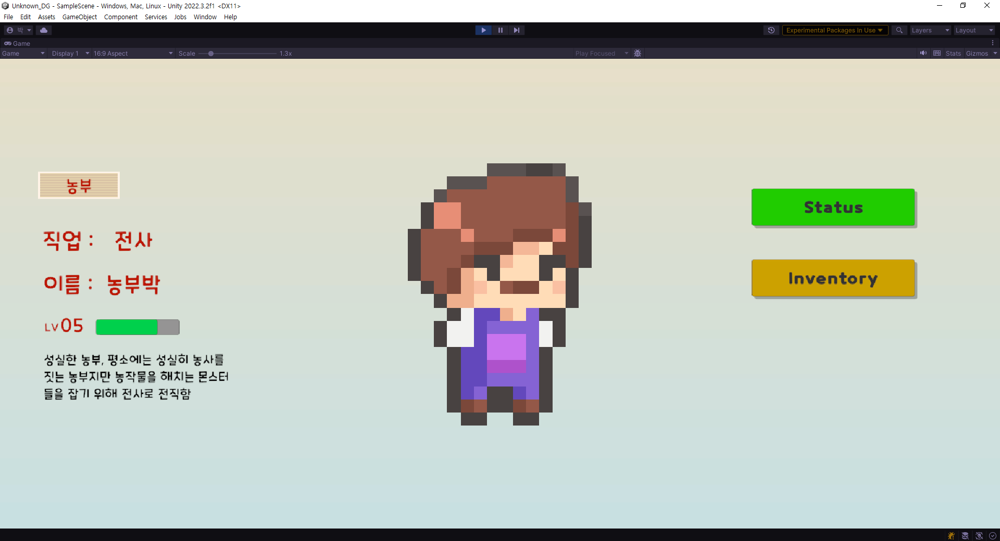
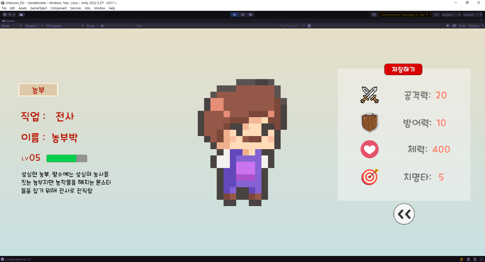
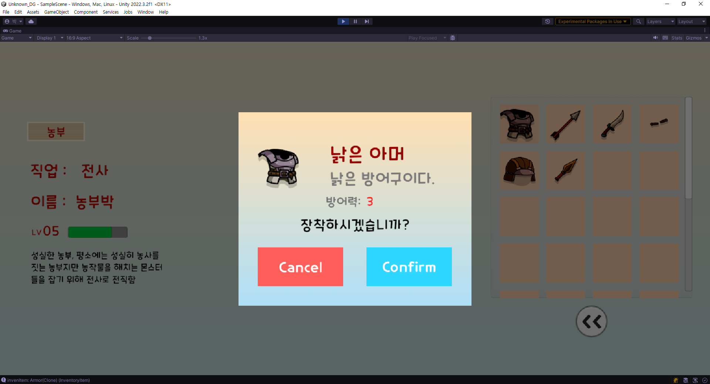
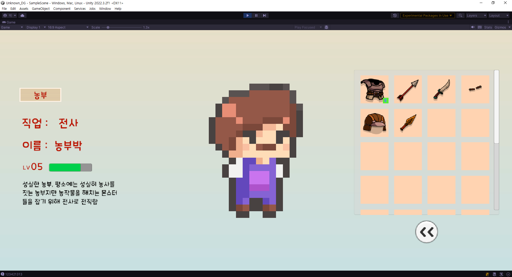
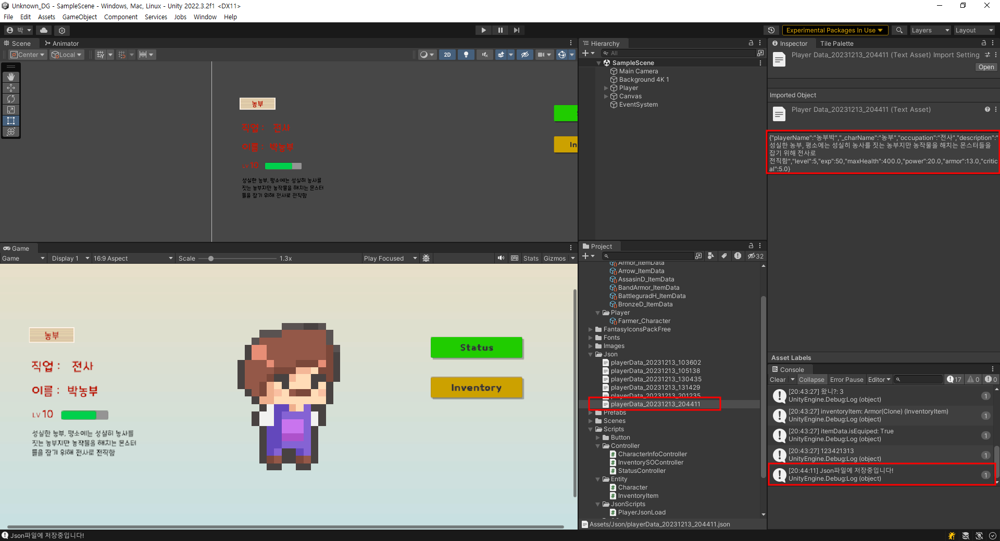

# Unknown DunGeon

 

> Unity 2D 캐릭터 스테이터스 창입니다.  
> 저번 프로젝트에 이어 스탯창과 인벤토리를 관리하고 있습니다.  
> ScriptableObject 사용연습을 중점으로 두었습니다.  
> 개발 기간은 5일입니다.

 

## 주요 기능

* 기본 페이지
    * 캐릭터 정보
    * 스테이터스 창
    * 인벤토리 창
    * 데이터 저장

## 기능 세부 설명
* 기본페이지
    * 기본페이지에서는 캐릭터의 스테이터스를 보여줍니다.
    * 스테이터스 버튼과 인벤토리 버튼을 보여줍니다.

* 스테이터스
    * 스테이터스는 기본 스탯을 보여줍니다.
    * 기존에 장착하고 있던게 저장되어있다면, 스탯이 더 높게 출력됩니다.

* 인벤토리 창
    * 소지하고있는 장비가 들어가있습니다.
    * 장비를 누르면 해당 장비를 장착할지 말지를 선택할 수 있습니다.
    * 장비 장착시에 표시가 되며 그 값만큼 스테이터스가 올라갑니다.

##  기술 스택

## 구현한 기능

__게임 시작 화면__

  

* 캐릭터 메인 화면에 입력된 데이터를 출력  
* 좌측에는 캐릭터정보, 우측에는 스테이터스와 인벤토리 버튼  

 

__스테이터스 화면__

  

* 기본 스테이터스 화면
* 플레이어에 들어있는 스테이터스를 출력해줌
* 위에 저장버튼이 있고 아래는 다시 메인화면으로 돌아가는 버튼

 

__인벤토리 화면__

  

* 기본 인벤토리 화면
* 현재는 장비를 미장착한 상태임
* 프리팹으로 만든 장비들을 뿌려줌
* 버튼 형식이며 클릭시 해당 장비의 스테이터스와 정보들이 나옴

 

__장비 장착 팝업화면__

  

* 아이템을 클릭할 시에 팝업창 출력
* 장비의 정보들이 나타나 있음
* Cancel버튼시 미장착, Confirm버튼시 장착됨
* 장착시에 장착표시 및 캐릭터에 적용

 

__장비 장착시 인벤토리__

  

* 장비 장착시 e라고 아래 표시
* 장착했을 경우 스테이터스 증가
* Scriptable Object로 isEquip 토글을 관리하고 있어서 저장 가능

 

__장비 장착시 스테이터스 창__

  

* 장비 장착 후 들어오면 정보가 저장되어있음
* 방어력이 10 ->  13으로 변화한 모습을 볼 수 있음

 

__데이터 저장__

  

* 스테이터스 창 위에 저장버튼시 저장가능
* Json파일로 관리
* 저장은 해본적이 없어서 한번 넣어본 기능임

 

## 프로젝트 시 일어난 문제와 해결  

### 프로젝트

__문제__:  
 
SetAtive(false) 를 들고오지 못하는 문제가 있었습니다., 초기에 오브젝트가 꺼져있으면 찾을 수 없다는 사실을 Log를 통해 알아내서 이를 어떤식으로 해결할까 고민해봤습니다. 장비 장착시에 E라는 문자 이미지를 띄워줘야 하는데 처음 시작부터 꺼져있기때문에 GetComponentInChildren으로 찾을 수 없어서 애를 먹었습니다.

__결과__:  

토글해주는 스크립트 (Inventory) 를 만들어 각 프리팹에 넣어준 후, 가져와야할 E 이미지 오브젝트를 넣은 후 이를 들고오는 방식으로 가져왔습니다. << 해결됨!  

__문제__:  

GetComponentsInChildren()사용에 문제가 있었습니다. 프리팹 아래의 장비 장착 여부의 이미지를 들고오고 싶었는데 계속 자기자신을 들고오는 현상이 있었습니다.

__결과__:  

GetComponentsInChildren() 는 배열형식이며, 이는 자기자신이 0번이라는 사실을 튜터님을 통해 알았습니다.
이후에 계속 쓰일거같기 떄문에 DATA에 각각 고유의 id값을 부여하여 이를 들고오는 식으로 해결했습니다. <<해결됨!

__문제__:  

문제라기보다는 처음에는 ScriptableObject를 사용하지 않고 그냥 값을 가져왔다면, 이를 공부하기 위해 Scriptable Object를 사용한 것도 있지만, List로 이미지 안에 아이템을 가져올 때 인벤토리의 기존 판 역할을 하는 배경 img와 화살 img가 함께 가져오는 현상이 있어서 이를 좀 더 나은 방법으로 해보고자 하여 사용하였습니다.

__결과__:  

Prefab에서 장비를 관리하여 시작할 때 뿌려주는 식으로 해결하니 img아래 img를 list로 들고오는 방법이 해결되어 깔끔해졌습니다 << 해결됨!

## 프로젝트 소감

    
펼치기 / 접기

    프로젝트 하면서 Scriptable Object사용을 중점으로 두었으며, 완벽하지는 않지만 어느정도 이해하면서 사용했다는 점이 좋았습니다. 아쉬운점은 상점을 구현하지 못했다는 점과 중간중간 보면 컴포넌트를 매개변수로 넘기는데 이 부분이 조금 불편했던점이 아쉬웠습니다. 그리고 기본 설계 자체도 약간의 아쉬움이 있었으며, 특히 기본스탯이나 장착된 상태로 들어왔을 때 기본 정보를 적용시키기 위해 약간의 중복되는 코드가 있는 것 같아서 아쉬웠습니다. 마지막으로 게임오브젝트라던지 변수명도 아쉬운점이었다는게 코드리뷰를 하면서 다른 분들에게 보여주면서 느꼈습니다. 이후에는 좀 더 남들이 알아볼 수 있는 코드와 변수명들로 잘 할 수 있도록 발전하고싶습니다.

